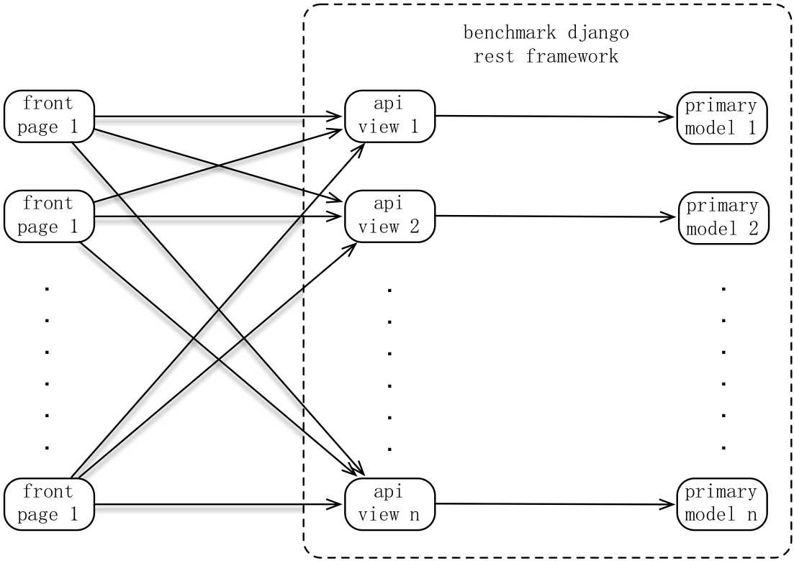
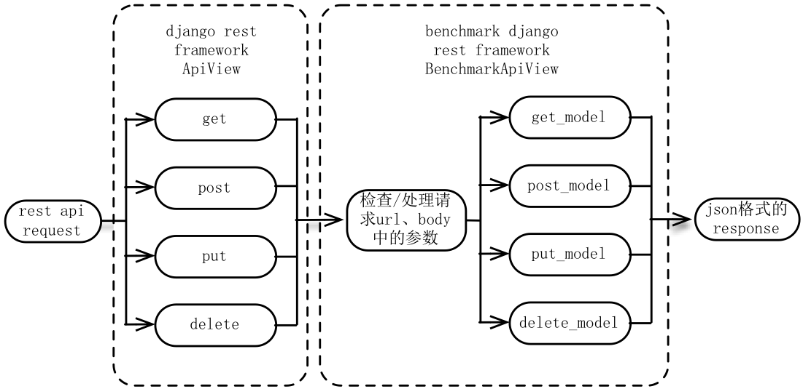
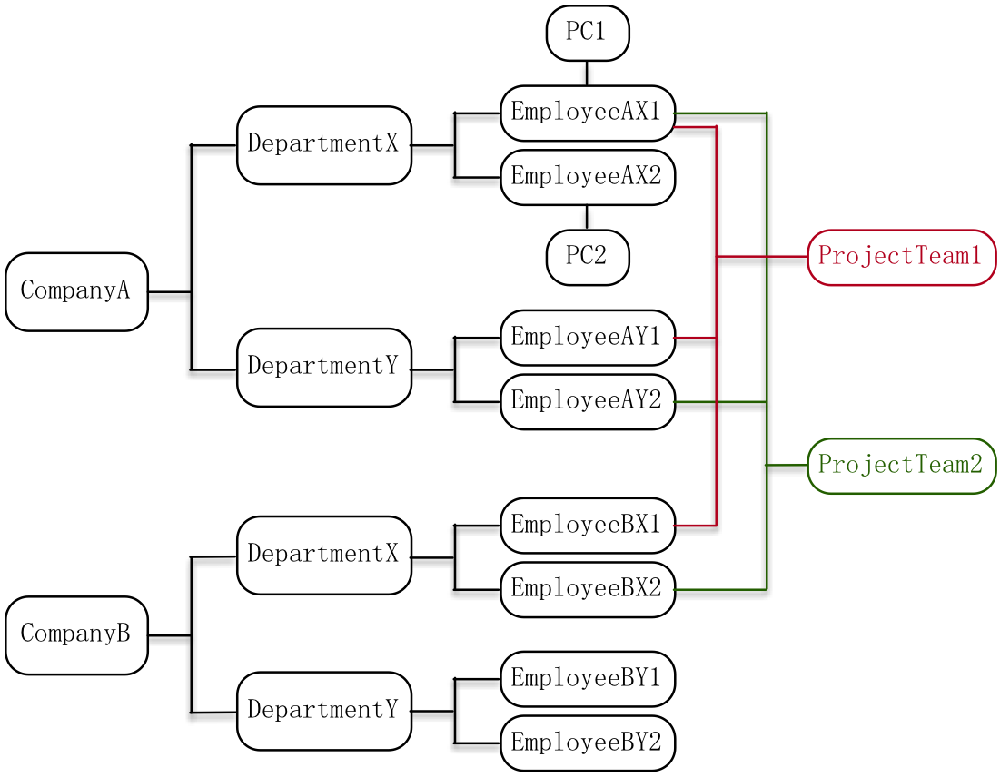

# Benchmark Django Rest Framework —— Django Rest API的高效开发框架

# **1.引言**

django rest framework是django后端开发中最流行的成熟框架。本文介绍的benchmark django rest framework是基于django rest framework的django rest api后端开发框架。本框架有快速开发、极低的维护成本、支持复杂的model查询、以及增、删、改操作、易于扩展等特点。目前已经过许多版本的迭代优化和实际的开发应用，能够支持绝大多数接口的开发场景，尤其是针对数据库操作为主要功能的平台接口开发优势明显——**2行代码一个接口、自适应model的rest api、0维护成本**。本文将介绍本框架的设计思路、以及基于本框架的开发方法及接口使用方法等。

# **2.源起**

在使用django rest framework或其它一些django后端接口框架的开发中，不难发现至少有如下一些共性问题，这些问题也正是催生本框架的最初动机：

**问题一：开发效率低——繁琐冗余代码太多**

往往有时候开发一个接口需要写很多代码，即使这些接口的主要功能都是对model的查、增、改、删操作，而很少有其它复杂的操作逻辑。比如，django rest framework的序列化开发的接口，需要先写和model等量的代码，并且每种http method都需要写一段代码进行开发，详见<http://www.django-rest-framework.org/tutorial/1-serialization/>。

**问题二：开发效率低——接口复用性太差**

虽然问题一是能够通过一些方法来实现代码量的极大减少，但是比如需要http get请求的接口，要以各种方式对model的查询，即请求的参数是完全不同的，并且对查询结果的返回字段也是有不同的，即需要过滤各种不同的字段、或排序、或返回结果数量的限制等，那么这些框架需要针对每种不同的http get请求开发一个独立的接口，即使这些接口都是对同一些model进行操作。接口数量多了，自然开发和维护成本也就更高。

**问题三：维护成本高**

model里面的各种字段一旦有任何变化（增、删、改），接口代码需要跟着变。

**问题四：django model使用不够熟练，导致开发困难或数据库查询效率低**

django支持用model对数据库的多表查询，可以很方便地写出代码进行复杂的数据库查询，而不用写晦涩的SQL语句，并且查询结果也能很方便地转换为python的类型。但是，若对django的model查询不够熟悉的话，尤其是多表查询，可能写的代码实际在django底层转化为SQL语句并执行对效率会很低，甚至有些复杂的查询不清楚如何用model进行操作而改用晦涩的SQL语句去处理。所以，开发复杂程度增加，工作量和bug量也会增加。

**问题五：与接口调用方协同开发效率低**

常规的接口开发，需要和调用方（如前端或其它系统）约定接口的输入、输出，并且如果调用方的需求还未定，接口无法先进行独立的开发。而如果这些接口是rest api，并且功能基本上是对数据库的查／增／改／删，有必要这么麻烦吗？

**问题六：各种框架需要一定的学习成本**

**问题七：对于所使用的框架无法满足的常用接口功能，需要自行开发和维护**

# **3.目标**

benchmark django rest framework就是为解决如上一章节中的这些问题而开始开发的：

**问题一的解决：尽可能少的代码实现**

目前已实现了一个支持http get/post/put/delete的接口api view，每个这样的view只需2行代码，这绝对是个极限的代码行数了。

**问题二的解决：一个接口统统搞定**

支持各种django field lookups的关键字以及order_by、select_related等函数名作为查询关键字，并自定义了一些常用接口功能所需的关键字，以支持各种复杂的查询。同时，一个接口对应惟一一个primary_model，可以由该primary_model作为起点，利用django的外键、一对一、多对多关系或这些关系的反向关联关系进行无限的多表关联查询。

**问题三的解决：0维护成本**

因本框架是动态获取model中的字段，接口代码不用修改也能适应model中字段的变化。

**问题四的解决：放心交给框架本身**

框架会根据接口请求的关键字，以最优的方式进行model操作。甚至对有复杂业务处理逻辑的接口，也能使用框架的对应函数，来替代你代码中的大段model操作代码。该框架使用django model操作数据库，而非SQL语句实现，这样也就不必担心SQL注入的风险，因为django model已经处理了SQL注入：<https://docs.djangoproject.com/en/1.11/topics/security/#sql-injection-protection>

**问题五的解决：使用框架的rest api**

后端接口可以独立先开发，前端或其它调用接口的系统只需遵守rest api和框架定义的各种关键字即可。

**问题六的解决：极低的学习成本**

本框架对于熟悉django老手来说，学习成本相对其它框架可以忽略不计。因为本框架在设计上，使用简单，常用的函数只有四个，分别对应一个http请求method，各种请求参数的关键字名默认配置为对应的django model操作的关键字名或函数名。而对于django新手来说，虽然需要学习这些内容，但如果掌握了，其实就能同时对django model操作的方法也能掌握。所以实际的学习成本就是django本身，而框架本身的学习成本可以忽略不计。

**问题七的解决：有常用的接口功能，可做进框架**

目前已经实现了很多常用功能，并且新功能不断加入中。比如，目前做的最复杂的一个功能是支持model标记位删除，即delete请求不删除model中的条目，而是修改model中的一个删除标记位字段为True。这样的话，该表的惟一性约束、关联表中条目的一致性等原本可由数据库来维护的工作，都需要框架本身进行维护。

# **4.假设**

本框架的开发，是以以下两个假设作为前提，即可行性的理论依据：

**假设一：数据库的各种操作，即SQL语句，都能用django model的各种关键字或函数来实现**

虽然我没有对所有SQL语句进行深入研究，但实际使用时，没有碰到过SQL语句能实现而django model实现不了的。

**假设二：各种django model的操作，都能通过http请求的参数描述清楚**

对model的查、增、改、删，分别能用get/post/put/delete区别，而各种model的关键字以及函数操作，也是能通过直接使用django model操作的关键字、函数或自定义一些特定的请求关键字，以标识这些model操作。

所以，基于以上两条假设的成立，一个rest api请求，完全能够对应数据库的查、增、改、删操作，这样，框架本身就能根据http请求的参数，对数据库进行正确的操作了。这样，本框架开发的可行性和日后的维护更新以支持更多的功能变得可行。

# **5.设计**

这一章节，介绍本框架的架构设计。

通常情况下，在本框架中，每个view惟一对应一个model，这个model我们称为是这个view的primary_model。各种接口请求（get／post／put／delete）使用框架中约定的关键字参数即可对primary_model进行查／增／改／删操作。而get请求更能从primary_model作为起点，通过django model的ForeignKey／OneToOneField／ManyToManyField，即外键关系／一对一关系／多对多关系，及其反向关系进行多表查询。

下图是前后端接口交互、接口和model交互的示意图，框架内部设计简洁，view和model一对一关系，而框架的接口对外能应对各种类型请求，进行各种model的操作。

本框架一个rest api请求，完整的处理逻辑顺序如下图所示。

本框架的BenchmarkApiView类（上图中的api view都继承于该类）继承了django rest framework的ApiView类，使用的ApiView中的get／post／put／delete函数获取原始请求，经检查处理请求url、body中的参数后，使用get_model／post_model／put_model／delete_model函数对数据库进行操作，最终返回json格式的响应。默认配置的响应字段有3个：code（状态码）、msg（错误信息）、data（数据库数据相关信息）。

若使用本框架，对有复杂业务逻辑的接口进行开发的话，可以覆盖父类（BenchmarkApiView）的get_model／post_model／put_model／delete_model函数。甚至在复杂业务逻辑处理完或处理过程中，需要对数据库进行操作，也能调用父类的这4个对应函数以方便地操作数据库。

# **6.场景**

为了更简单易懂地描述本框架的功能和使用方法，设计了如下图的场景。后一章节基于该场景来描述本框架。

上图中包含了各种django model的多表关系：

一个公司可以有多个部门，一个部门可以有多个员工，即外键关系

每个员工可以有一个电脑，即一对一关系

每个员工可以属于多个项目组，每个项目组可以有多个成员，即多对多关系

如上图，定义django的各个model，代码如下。使用本框架，每个model除了需要继承django.db.models.Model外，需要再额外多继承BenchmarkModel：

	from benchmark_django_rest_framework.benchmark_model import BenchmarkModel
	from django.db import models

	class Company(BenchmarkModel, models.Model):
		company_id = models.IntegerField(primary_key=True)
		company_name = models.CharField(max_length=64)

	class Department(BenchmarkModel, models.Model):
		department_id = models.IntegerField(primary_key=True)
		department_name = models.CharField(max_length=64)
		company = models.ForeignKey(Company)

	class Employee(BenchmarkModel, models.Model):
		employee_id = models.IntegerField(primary_key=True)
		employee_name = models.CharField(max_length=64)
		department = models.ForeignKey(Department)
		employee_info = models.TextField(max_length=1024, null=True)

	class ProjectTeam(BenchmarkModel, models.Model):
		project_team_id = models.IntegerField(primary_key=True)
		project_team_name = models.CharField(max_length=64)
		members = models.ManyToManyField(Employee)

	class PC(BenchmarkModel, models.Model):
		pc_id = models.IntegerField(primary_key=True)
		pc_name = models.CharField(max_length=64)
		employee = models.OneToOneField(Employee)

数据库初始数据如下，如下数据都是可以通过model对应view的post请求发送，来新增条目的：

	init_companies = [
	    {"company_id": 1, "company_name": "CompanyA"},
	    {"company_id": 2, "company_name": "CompanyB"},
	]

	init_departments = [
	    {"department_id": 1, "department_name": "DepartmentX", "company": 1},
	    {"department_id": 2, "department_name": "DepartmentY", "company": 1},
	    {"department_id": 3, "department_name": "DepartmentX", "company": 2},
	    {"department_id": 4, "department_name": "DepartmentY", "company": 2},
	]

	init_employees = [
	    {"employee_id": 1, "employee_name": "EmployeeAX1", "department": 1,
	        "employee_info": "{\\"sex\\": \\"male\\", \\"age\\": 40}"},
	    {"employee_id": 2, "employee_name": "EmployeeAX2", "department": 1,
	        "employee_info": "{\\"sex\\": \\"female\\", \\"new_employee\\": true}"},
	    {"employee_id": 3, "employee_name": "EmployeeAY1", "department": 2},
	    {"employee_id": 4, "employee_name": "EmployeeAY2", "department": 2},
	    {"employee_id": 5, "employee_name": "EmployeeBX1", "department": 3},
	    {"employee_id": 6, "employee_name": "EmployeeBX2", "department": 3},
	    {"employee_id": 7, "employee_name": "EmployeeBY1", "department": 4},
	    {"employee_id": 8, "employee_name": "EmployeeBY2", "department": 4},
	]

	init_project_teams = [
	    {"project_team_id": 1, "project_team_name": "ProjectTeam1", "members": [1, 3, 5]},
	    {"project_team_id": 2, "project_team_name": "ProjectTeam2", "members": [1, 4, 6]},
	]

	init_pcs = [
	    {"pc_id": 1, "pc_name": "PC1", "employee": 1},
	    {"pc_id": 2, "pc_name": "PC2", "employee": 2},
	]

# **7.体验**

本章介绍如何方便地使用本框架，高效地开发出接口，以及如何使用这些接口。

## **7.1.开发**

使用本框架的接口，若没有特殊逻辑，view仅对model进行相应的操作，每个接口只需2行代码，即继承BenchmarkAPIView，和定义primary_model，对上一章节中定义的model，相应的view定义如下：

	from benchmark_django_rest_framework.benchmark_api_view import BenchmarkAPIView
	from benchmark_app.models import \*

	class CompanyView(BenchmarkAPIView):
		primary_model = Company

	class DepartmentView(BenchmarkAPIView):
		primary_model = Department

	class EmployeeView(BenchmarkAPIView):
		primary_model = Employee

	class ProjectTeamView(BenchmarkAPIView):
		primary_model = ProjectTeam

	class PCView(BenchmarkAPIView):
		primary_model = PC

url的定义，和使用django rest framework框架的定义完全一样：

	url(r'\^company/(?P\<pk\>\\d+)\$', CompanyView.as_view()),
	url(r'\^company\$', CompanyView.as_view()),
	url(r'\^department/(?P\<pk\>\\d+)\$', DepartmentView.as_view()),
	url(r'\^department\$', DepartmentView.as_view()),
	url(r'\^employee/(?P\<pk\>\\d+)\$', EmployeeView.as_view()),
	url(r'\^employee\$', EmployeeView.as_view()),
	url(r'\^project_team/(?P\<pk\>\\d+)\$', ProjectTeamView.as_view()),
	url(r'\^project_team\$', ProjectTeamView.as_view()),
	url(r'\^pc/(?P\<pk\>\\d+)\$', PCView.as_view()),
	url(r'\^pc\$', PCView.as_view()),

## **7.2.使用**

#＃# **7.2.1.get请求：单表查询**

先尝试一下单表查询，查询员工名最后是字符串“X2”，并且部门外键是1或2的员工，接口请求：

http://127.0.0.1:8000/employee?employee_name__endswith=X2&department__in=[1,2]

如上请求参数中的employee_name和department都是Employee这个model中定义的字段，而endswith、in关键字，是django定义的field lookups关键字。目前django支持的field lookups关键字如下：<https://docs.djangoproject.com/en/1.11/ref/models/querysets/#field-lookups>

实际转化为django model的查询代码为：
Employee.objects.filter(employee_name__endswith='X2', department__in=[1,2])

可以看出，本框架可以直接使用django field lookups关键字。所以，老手对此0学习成本，对于新手能顺便把django的各种model查询也学会了。

查询出惟一一个满足条件的员工，其中employee_info字段可以通过一行配置代码，令其转化为json格式（原始格式如果是可以转化为json的字符串，否则不会转化），接口响应：

	{

	  "code": 0,

	  "msg": "success",

	  "data": [

	    {

	      "employee_name": "EmployeeAX2",

	      "employee_id": 2,

	      "employee_info": {

	        "new_employee": true,

	        "sex": "female"

	      },

	      "department": 1

	    }

	  ]

	}

### **7.2.2.get请求：多对一、一对一关系的多表查询**

再尝试一下多表查询，多表查询在使用默认配置下，用自定义的select_related关键字实现，命名取自django model中的select_related函数,多个连续关系可以用“__”连接，这些其实也都是按django语法进行设计的，所以同样很好理解。

查询CompanyB中DepartmentX中的所有员工，接口请求：

http://127.0.0.1:8000/employee?department__company__company_name=CompanyB&department__department_name=DepartmentX&select_related=department__company

实际转化为django model的查询代码如下：

Employee.objects.filter(
department__company__company_name='CompanyB',
department__department_name='DepartmentX'
).select_related('department__company')

可以看出请求参数一一对应django model操作的语法。另外，还可以看出，本框架也支持多对一、一对一关联model中的字段的django field lookups关键字过滤。

接口响应：

	{

	  "msg": "success",

	  "data": [

	    {

	      "employee_id": 5,

	      "company_id": 2,

	      "department": 3,

	      "company_name": "CompanyB",

	      "department_id": 3,

	      "employee_info": null,

	      "department_name": "DepartmentX",

	      "employee_name": "EmployeeBX1"

	    },

	    {

	      "employee_id": 6,

	      "company_id": 2,

	      "department": 3,

	      "company_name": "CompanyB",

	      "department_id": 3,

	      "employee_info": null,

	      "department_name": "DepartmentX",

	      "employee_name": "EmployeeBX2"

	    }

	  ],

	  "code": 0

	}

一对一关系的关联查询，同样使用select_related关键字，举例如下：

查询主键为1的PC及其对应的Employee，接口请求：

http://127.0.0.1:8000/pc/1?select_related=employee

实际转化为django model的查询代码为：

PC.objects.filter(pk=1).select_related('employee')

接口响应：

	{

	  "msg": "success",

	  "data": [

	    {

	      "employee_id": 1,

	      "employee": 1,

	      "employee_info": {

	        "sex": "male",

	        "age": 40

	      },

	      "pc_id": 1,

	      "employee_name": "EmployeeAX1",

	      "pc_name": "PC1"

	    }

	  ],

	  "code": 0

	}

一对一关系的关联查询，同样使用select_related关键字，使用在一对一关系的反向关联名related_name作为select_related参数的值。在我们的例子中，没有显式定义related_name，而使用默认的related_name，即一对一关系所在model名（全小写），举例如下：

如上这个例子，改用employee接口实现，即查询主键为1的Employee及其PC，接口请求：

http://127.0.0.1:8000/employee/1?select_related=pc

实际转化为django model的查询代码为：

Employee.objects.filter(pk=1).select_related('pc')

接口响应如下，和上一个例子的响应内容完全一致：

	{

	  "msg": "success",

	  "data": [

	    {

	      "employee_id": 1,

	      "department": 1,

	      "employee_info": {

	        "sex": "male",

	        "age": 40

	      },

	      "pc_id": 1,

	      "employee_name": "EmployeeAX1",

	      "pc_name": "PC1"

	    }

	  ],

	  "code": 0

	}

### **7.2.3.get请求：一对多、多对多关系的多表查询**

虽然select_related在django model中只用于多对一关系和一对一关系，但本框架为了方便使用者，select_related关键字也能用于一对多查询和多对多查询。

一对多关系，即反向外键关系，使用在外键中定义的反向关联名related_name作为select_related参数值。在我们的例子中，没有显式定义related_name，而使用默认的related_name，即外键所在model名（全小写）加上“_set”，举例如下：

查询主为2的部门下的所有员工，接口请求：

http://127.0.0.1:8000/department/2?select_related=employee_set

接口响应：

	{

	  "code": 0,

	  "data": [

	    {

	      "department_name": "DepartmentY",

	      "employee_set": [

	        {

	          "department": 2,

	          "employee_name": "EmployeeAY1",

	          "employee_info": null,

	          "employee_id": 3

	        },

	        {

	          "department": 2,

	          "employee_name": "EmployeeAY2",

	          "employee_info": null,

	          "employee_id": 4

	        }

	      ],

	      "company": 1,

	      "department_id": 2

	    }

	  ],

	  "msg": "success"

	}

多对多关系、反向对多多关系的查询，其关联关系的关键字名／值依然使用select_related／related_name，默认的反向多对多关系related_name是多对多关系所在model名（全小写）加上“_set”，举例如下：

多对多关系查询，查询主键为1的项目组及其所有成员，接口请求：

http://127.0.0.1:8000/project_team/1?select_related=members

接口响应：

	{

	  "code": 0,

	  "data": [

	    {

	      "project_team_id": 1,

	      "members": [

	        {

	          "department": 1,

	          "employee_name": "EmployeeAX1",

	          "employee_info": {

	            "age": 40,

	            "sex": "male"

	          },

	          "employee_id": 1

	        },

	        {

	          "department": 2,

	          "employee_name": "EmployeeAY1",

	          "employee_info": null,

	          "employee_id": 3

	        },

	        {

	          "department": 3,

	          "employee_name": "EmployeeBX1",

	          "employee_info": null,

	          "employee_id": 5

	        }

	      ],

	      "project_team_name": "ProjectTeam1"

	    }

	  ],

	  "msg": "success"

	}

反向多对多关系查询，查询主键为1的员工及其所在的项目组，接口请求：

http://127.0.0.1:8000/employee/1?select_related=projectteam_set

接口响应：

	{

	  "code": 0,

	  "data": [

	    {

	      "department": 1,

	      "projectteam_set": [

	        {

	          "project_team_id": 1,

	          "project_team_name": "ProjectTeam1"

	        },

	        {

	          "project_team_id": 2,

	          "project_team_name": "ProjectTeam2"

	        }

	      ],

	      "employee_name": "EmployeeAX1",

	      "employee_id": 1,

	      "employee_info": {

	        "age": 40,

	        "sex": "male"

	      }

	    }

	  ],

	  "msg": "success"

	}

### **7.2.4.get请求：结合使用多种关联关系的复杂查询**

关联model的查询可以无限关联到任意多个model，并且支持多个select_related值（多个关联关系的分支），可以使用数组的形式，数组内以“,”分割多个值，注意不要有空格等其它无关的字符。

从company接口作为起点，查询本文例子中的所有数据，即公司、部门、员工、电脑、项目组，接口请求：

http://127.0.0.1:8000/company?select_related=[department_set__employee_set__projectteam_set,department_set__employee_set__pc]

查询到包含所有model中数据的信息，返回结果按查询请求，分层次显示，接口响应：

	{

	  "code": 0,

	  "data": [

	    {

	      "company_id": 1,

	      "company_name": "CompanyA",

	      "department_set": [

	        {

	          "company": 1,

	          "employee_set": [

	            {

	              "pc_id": 1,

	              "employee_info": {

	                "sex": "male",

	                "age": 40

	              },

	              "department": 1,

	              "employee_name": "EmployeeAX1",

	              "pc_name": "PC1",

	              "employee_id": 1,

	              "projectteam_set": [

	                {

	                  "project_team_name": "ProjectTeam1",

	                  "project_team_id": 1

	                },

	                {

	                  "project_team_name": "ProjectTeam2",

	                  "project_team_id": 2

	                }

	              ]

	            },

	            {

	              "pc_id": 2,

	              "employee_info": {

	                "sex": "female",

	                "new_employee": true

	              },

	              "department": 1,

	              "employee_name": "EmployeeAX2",

	              "pc_name": "PC2",

	              "employee_id": 2,

	              "projectteam_set": []

	            }

	          ],

	          "department_name": "DepartmentX",

	          "department_id": 1

	        },

	        {

	          "company": 1,

	          "employee_set": [

	            {

	              "employee_info": null,

	              "department": 2,

	              "employee_name": "EmployeeAY1",

	              "employee_id": 3,

	              "projectteam_set": [

	                {

	                  "project_team_name": "ProjectTeam1",

	                  "project_team_id": 1

	                }

	              ]

	            },

	            {

	              "employee_info": null,

	              "department": 2,

	              "employee_name": "EmployeeAY2",

	              "employee_id": 4,

	              "projectteam_set": [

	                {

	                  "project_team_name": "ProjectTeam2",

	                  "project_team_id": 2

	                }

	              ]

	            }

	          ],

	          "department_name": "DepartmentY",

	          "department_id": 2

	        }

	      ]

	    },

	    {

	      "company_id": 2,

	      "company_name": "CompanyB",

	      "department_set": [

	        {

	          "company": 2,

	          "employee_set": [

	            {

	              "employee_info": null,

	              "department": 3,

	              "employee_name": "EmployeeBX1",

	              "employee_id": 5,

	              "projectteam_set": [

	                {

	                  "project_team_name": "ProjectTeam1",

	                  "project_team_id": 1

	                }

	              ]

	            },

	            {

	              "employee_info": null,

	              "department": 3,

	              "employee_name": "EmployeeBX2",

	              "employee_id": 6,

	              "projectteam_set": [

	                {

	                  "project_team_name": "ProjectTeam2",

	                  "project_team_id": 2

	                }

	              ]

	            }

	          ],

	          "department_name": "DepartmentX",

	          "department_id": 3

	        },

	        {

	          "company": 2,

	          "employee_set": [

	            {

	              "employee_info": null,

	              "department": 4,

	              "employee_name": "EmployeeBY1",

	              "employee_id": 7,

	              "projectteam_set": []

	            },

	            {

	              "employee_info": null,

	              "department": 4,

	              "employee_name": "EmployeeBY2",

	              "employee_id": 8,

	              "projectteam_set": []

	            }

	          ],

	          "department_name": "DepartmentY",

	          "department_id": 4

	        }

	      ]

	    }

	  ],

	  "msg": "success"

	}

### **7.2.5.get请求：返回字段过滤**

有时候数据量较大，而接口调用方无需某些返回字段，则需要对返回字段过滤。默认配置下，使用values关键字，该关键字名称取自django model类似功能的values函数名。和该函数不同的是，本框架不仅支持白名单过滤，同时也支持黑名单过滤。黑名单前面加“-”，若过滤多个字段，使用列表。框架目前仅支持primary_model以及和primary_model有直接联系的一对一、反向一对一、多对一关系的model中的关键字过滤。

白名单过滤，查询主键为1的员工名、部门名、公司名、电脑名：

http://127.0.0.1:8000/employee/1?select_related=[department__company,pc]&values=[company_name,department_name,employee_name,pc_name]

接口返回：

	{

	  "code": 0,

	  "data": [

	    {

	      "department_name": "DepartmentX",

	      "pc_name": "PC1",

	      "employee_name": "EmployeeAX1",

	      "company_name": "CompanyA"

	    }

	  ],

	  "msg": "success"

	}

黑名单过滤，所需查询内容同上例：

http://127.0.0.1:8000/employee/1?select_related=[department__company,pc]&values=-[company_id,department,department_id,employee_id,employee_info,pc_id]

接口返回同上例：

	{

	  "code": 0,

	  "data": [

	    {

	      "department_name": "DepartmentX",

	      "pc_name": "PC1",

	      "employee_name": "EmployeeAX1",

	      "company_name": "CompanyA"

	    }

	  ],

	  "msg": "success"

	}

### **7.2.6.post请求：新增数据**

框架的post请求用于对primary_model进行数据新增，第6章中初始化数据，都可以用于post请求的请求体中，进行新增数据。

按rest api的规范，请求url中不带任何参数，在请求体中定义新增数据。若需要在新增时，对多对多关系同时新增数据，可以增加如下例子中的“"members": [7, 8]”，进行批量多对多关系的新增，举例，新增一个项目组，并添加2个主键为7和8的员工作为成员，接口请求：

http://127.0.0.1:8000/project_team

请求体：

	{

	        "project_team_id": 3,

	        "project_team_name": "ProjectTeam3",

	        "members": [7, 8]

	}

接口响应，若新增成功，data字段中有primary_model的主键值pk，以方便接口调用方的后续操作（该例子中pk值即请求参数的project_team_id值，但由于model也有可能定义的是自增主键，这样新增条目的主键是接口调用方事先未知的）：

	{

	  "code": 0,

	  "data": {

	    "pk": 3

	  },

	  "msg": "success"

	}

### **7.2.7.put请求：修改数据**

框架的put请求用于对primary_model进行数据修改。

按rest api的规范，在请求url中定义需要修改的primary_model数据主键值。若需要修改多对多关系的值，可以增加如下例子中的“"members": [5， 6, 7]”，即将项目组成员修改为主键为5、6、7的员工，进行批量修改。若想删除所有的项目组成员，使用“"members": []”即可。接口请求：

http://127.0.0.1:8000/project_team/3

请求体：

	{

	  "project_team_name": "ProjectTeam3",

	  "members": [5, 6, 7]

	}

接口响应：

	{

	  "code": 0,

	  "msg": "success"

	}

补充说明：

因为django没有多对多关系表（django自动生成和维护的）的model，所以对于多对多关系的增、删、改，都设计成放在多对多关系所在model的接口的post、put请求中了。这样也能吻合django model操作的逻辑，便于理解。

### **7.2.8.delete请求：删除数据**

框架的delete请求用于对primary_model进行数据修改。

按rest api的规范，在请求url中定义需要修改的primary_model数据主键值。

删除员工model主键为1的员工数据，接口请求，无请求体：

http://127.0.0.1:8000/employee/1

接口响应：

	{

	  "code": 0,

	  "msg": "success"

	}

本框架支持批量删除，方法是请求url中不带任何参数，请求体中定义多个主键，举例如下，删除主键为2、3、4的员工，接口请求：

http://127.0.0.1:8000/employee

请求体：

	{

	  "pk": [2, 3, 4]

	}

接口响应：

	{

	  "code": 0,

	  "msg": "success"

	}

# **8.小结**

以上内容介绍了该框架的所针对的问题、及框架自身特点、设计思想、开发和使用接口的方法等。该框架还支持更多便捷易用的功能，比如本文中没有介绍的其它查询关键字、接口请求参数的检查、接口调用方登录身份的验证、model使用标记位删除等，这些都待您来进一步尝试。并且持续不断地有新功能加入和改进优化的版本。若您在使用该框架的过程中发现问题、改进点、建议、bug，请与我进行联系。
